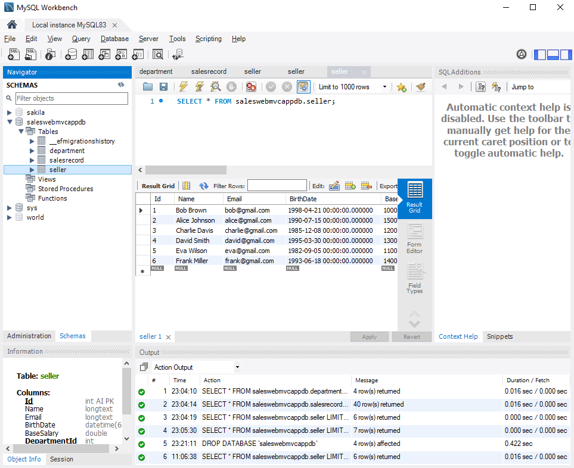

# GUI Web in ASP.NET Core using C# and Entity Framework


Este projeto modelo foi realizado como trabalho de finalização do curso <a href="https://www.udemy.com/course/programacao-orientada-a-objetos-csharp/">C# - Programação Orientada a Objetos + Projetos</a>, tendo como instrutor o <strong>Prof.Dr. Nélio Alves</strong>.

## Índice 📘
- <a href="#sobre-🔍re">Sobre </a>
    - <a href="#funcionalidades-⚙️">Funcionalidades</a>
    - <a href="#tecnologias-utilizadas-🛠️">Tecnologias utilizadas</a>
    - <a href="#layout-🖥️">Layout</a>
- <a>Como rodar</a>
- <a></a>
- <a></a>

## Sobre 🔍
Esta aplicação tem como objetivo a criação de um sistema de vendas para lojas, utilizando o framework <a href="https://github.com/dotnet/aspnetcore#getting-started">ASP.NET Core 2.1</a> em linguagem <a href="https://learn.microsoft.com/pt-br/dotnet/csharp/">C#</a> e utilização de um simples Banco de Dados <a href="https://www.mysql.com/">MySQL 8.0</a> 🐬

### Funcionalidades ⚙️
- [x] CRUD de departamentos
- [x] CRUD de vendedores
- [x] Simple Search de vendas por período
- [x] Grouping Search de vendas por departamento e período

### Tecnologias utilizadas 🛠️
- <a href="https://github.com/dotnet/aspnetcore#getting-started">ASP.NET Core 2.1</a>
- <a href="https://learn.microsoft.com/pt-br/dotnet/csharp/">C# Language</a>
- <a href="https://www.mysql.com/">MySQL 8.0</a> 
- <a href="https://bootswatch.com/3/">Bootstrap v.3</a>
- <a href="https://learn.microsoft.com/en-us/aspnet/core/mvc/views/razor?view=aspnetcore-8.0">Razor Engine</a>

### Layout 🖥️
## 
## 
## 
## 
## 

## Como rodar este projeto?
```bash
    # Clone este repositório
    $ git clone https://github.com/andyzaum/workshop-asp-net-core-mvc.git

    # Acesse a pasta do projeto no terminal
    $ cd ./SalesWebMvc

    # Instale as ferramentas do .NET na versão 2.1
    $ dotnet tool install --global dotnet-ef --version 2.1

    # Inicie a migração para um banco de dados
    $ dotnet ef database update

    # Execute a aplicação
    $ dotnet run

    # A aplicação será iniciada na porta 5001 por padrão (O 'IIS Express' pode alterar a porta conforme o necessário), acesse pelo navegador https://localhost:5001
```

### Possíveis problemas

```bash
    #Caso tenha versão mais recente do .NET você pode desinstalar com o comando
    $ dotnet tool uninstall --global dotnet-ef
    #E reinstalar utilizando o comando
    $ dotnet tool install --global dotnet-ef
```