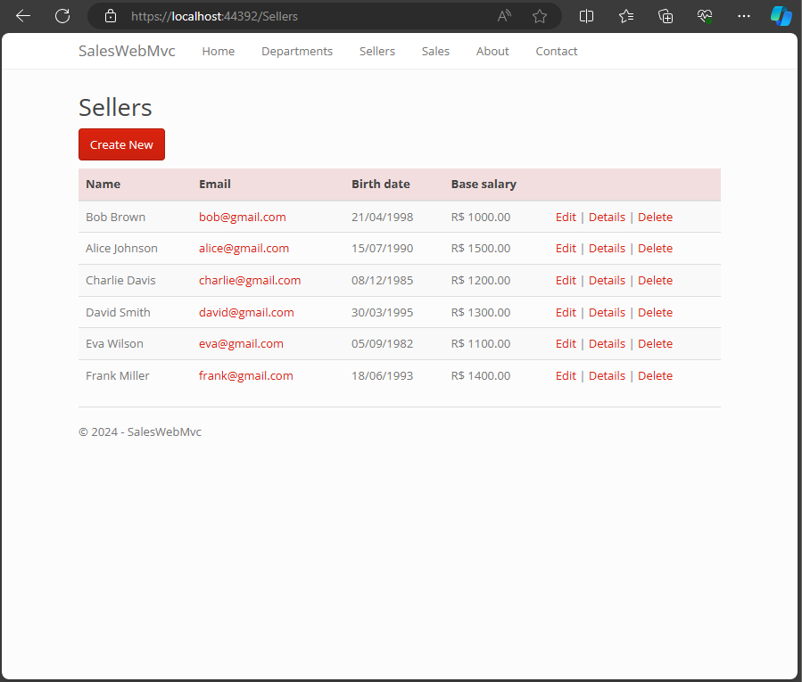

# GUI Web in ASP.NET Core using C# and Entity Framework
<div display="flex" align="center">


</div>

<p>Este projeto modelo foi realizado como trabalho de finalização do curso <a href="https://www.udemy.com/course/programacao-orientada-a-objetos-csharp/">C# - Programação Orientada a Objetos + Projetos</a>, tendo como instrutor o <strong>Prof.Dr. Nélio Alves</strong>.</p>

## Índice 📘
- <a href="#sobre-🔍">Sobre </a>
    - <a href="#funcionalidades-⚙️">Funcionalidades</a>
    - <a href="#tecnologias-utilizadas-🛠️">Tecnologias utilizadas</a>
    - <a href="#layout-🖥️">Layout</a>
- <a href="#como-rodar-o-projeto">Como rodar o projeto?</a>
    - <a href="#configuração-do-mysql-v80-🐬">Configuração do MySQL v8.0</a>
- <a href="#autor-🤓">Autor</a>
- <a href="#próximos-passos-🏃‍♂️">Próximos passos</a>

## Sobre 🔍
Esta aplicação tem como objetivo a criação de um sistema de vendas para lojas, utilizando o framework <a href="https://github.com/dotnet/aspnetcore#getting-started">ASP.NET Core 2.1</a> em linguagem <a href="https://learn.microsoft.com/pt-br/dotnet/csharp/">C#</a> e utilização de um simples Banco de Dados <a href="https://www.mysql.com/">MySQL v8.0</a> 🐬

### Funcionalidades ⚙️
- [x] CRUD de departamentos
- [x] CRUD de vendedores
- [x] Simple Search de vendas por período
- [x] Grouping Search de vendas por departamento e período

### Tecnologias utilizadas 🛠️
- <a href="https://github.com/dotnet/aspnetcore#getting-started">ASP.NET Core 2.1</a>
- <a href="https://learn.microsoft.com/pt-br/dotnet/csharp/">C# Language</a>
- <a href="https://www.mysql.com/">MySQL 8.0</a> 
- <a href="https://bootswatch.com/3/">Bootstrap v.3</a>
- <a href="https://learn.microsoft.com/en-us/aspnet/core/mvc/views/razor?view=aspnetcore-8.0">Razor Engine</a>

### Layout 🖥️
<div align="center" margin-top="150">




</div>

## Como rodar o projeto?


> <p align="center" style="font-size:18px;padding-top:20px"><span style="color:red">ATENÇÃO!</span> Para rodar esse projeto em sua máquina será necessário a configuração do <a href="https://www.mysql.com/">MySQL v8.0</a> 🐬 e o arquivo <span style="color:#f7c716">appsetting.json</span></p>
> <p align="center" style="font-size:15px;padding-bottom:20px"><a href="#configuração-do-mysql-v80-🐬">Clique aqui</a> para verificar a configuração.</p>

```bash
    # Clone este repositório
    $ git clone https://github.com/andyzaum/workshop-asp-net-core-mvc.git

    # Acesse a pasta do projeto no terminal
    $ cd ./SalesWebMvc

    # Instale as ferramentas do .NET na versão 2.1
    $ dotnet tool install --global dotnet-ef --version 2.1

    # Inicie a migração para um banco de dados
    $ dotnet ef database update

    # Execute a aplicação
    $ dotnet run

    # A aplicação será iniciada na porta 5001 por padrão, acesse pelo navegador http://localhost:5001 (Seu terminal informará caso seja utilizada outra porta).
```
> Note que o site informará que a conexão não é segura!
>
> Para acessar ele de forma segura é recomendado abrir o <a href="https://visualstudio.microsoft.com/pt-br/">Microsoft Visual Studio</a> e iniciar ele por lá. No qual utilizará do serviço <a href="https://learn.microsoft.com/pt-br/iis/extensions/introduction-to-iis-express/iis-express-overview">IIS Express</a> para gerar um servidor seguro.

## Configuração do MySQL v8.0 🐬

- <a href="#caso-não-tenha-mysql-👇">Caso NÃO tenha MySQL</a>
- <a href="#caso-já-tenha-mysql-👇">Caso tenha MySQL</a>

### Caso NÃO tenha MySQL 👇
1. Faça a instalação do MySQL no site oficial [hhttps://dev.mysql.com/downloads/mysql/](https://dev.mysql.com/downloads/mysql/)
2. Na instalação será iniciado um serviço de rede do servidor nomeado de 'MySQL80'. (Você poderá verificar ele indo em 'Serviços' da sua máquina)
3. Após tudo instalado abra o MySQL Workbench e conecte com o servidor criado
4. Para que o programa identifique seu servidor será necessário alterar o <a href="./SalesWebMvc/appsettings.json">appsettings.json</a> localizado em './SalesWebMvc/appsettings.json'.
5. Em <a href="./SalesWebMvc/appsettings.json">appsettings.json</a> altere o <strong style="color:#ab6f2e">//YourID//</strong> e <strong style="color:#ab6f2e">//YourPassword//</strong> para o user e senha informado na criação do servidor
```json
{
  "Logging": {
    "LogLevel": {
      "Default": "Warning"
    }
  },
  "AllowedHosts": "*",
  "ConnectionStrings": {
    "SalesWebMvcContext": "server=localhost;userid=//YourID//;password=//YourPassword//;database=saleswebmvcappdb"
  }
}
```

#### Exemplo:
```json
}
//...
"AllowedHosts": "*",
  "ConnectionStrings": {
    "SalesWebMvcContext": "server=localhost;userid=developer;password=123456789;database=saleswebmvcappdb"
  }
}
```
6. Após finalizado a alteração, basta salvar e retornar para os passos de "[Como rodar o Como rodar este projeto?](#como-rodar-este-projeto)"

### Caso já tenha MySQL 👇
1. Para que o programa identifique seu servidor será necessário alterar o <a href="./SalesWebMvc/appsettings.json">appsettings.json</a> localizado em './SalesWebMvc/appsettings.json'.
2. Em <a href="./SalesWebMvc/appsettings.json">appsettings.json</a> altere o <strong style="color:#ab6f2e">//YourID//</strong> e <strong style="color:#ab6f2e">//YourPassword//</strong> para o user e senha informado na criação do servidor
```json
{
  "Logging": {
    "LogLevel": {
      "Default": "Warning"
    }
  },
  "AllowedHosts": "*",
  "ConnectionStrings": {
    "SalesWebMvcContext": "server=localhost;userid=//YourID//;password=//YourPassword//;database=saleswebmvcappdb"
  }
}
```

#### Exemplo:
```json
}
//...
"AllowedHosts": "*",
  "ConnectionStrings": {
    "SalesWebMvcContext": "server=localhost;userid=developer;password=123456789;database=saleswebmvcappdb"
  }
}
```
6. Após finalizado a alteração, basta salvar e retornar para os passos de "[Como rodar o Como rodar este projeto?](#como-rodar-este-projeto)"

## Autor 🤓


<style>
    .ul{
        list-style:none;
        display:flex;
        justify-content:space-around;
        align-items:center;
        margin-top:20px
    }
    .li{
        display:flex;
        flex-direction: column;
        justify-content:space-around;
        align-items: center;
    }
    p{
        font-size:20px;
    }
</style>

<div align="center">
    
    <p>Anderson Schlösser</p>
</div>
<ul class="ul">
    <li class="li">
       <svg xmlns="http://www.w3.org/2000/svg" x="0px" y="0px" width="80" height="80" viewBox="0 0 48 48">
<path fill="#0288D1" d="M42,37c0,2.762-2.238,5-5,5H11c-2.761,0-5-2.238-5-5V11c0-2.762,2.239-5,5-5h26c2.762,0,5,2.238,5,5V37z"></path><path fill="#FFF" d="M12 19H17V36H12zM14.485 17h-.028C12.965 17 12 15.888 12 14.499 12 13.08 12.995 12 14.514 12c1.521 0 2.458 1.08 2.486 2.499C17 15.887 16.035 17 14.485 17zM36 36h-5v-9.099c0-2.198-1.225-3.698-3.192-3.698-1.501 0-2.313 1.012-2.707 1.99C24.957 25.543 25 26.511 25 27v9h-5V19h5v2.616C25.721 20.5 26.85 19 29.738 19c3.578 0 6.261 2.25 6.261 7.274L36 36 36 36z"></path>
</svg>
        <a href="https://www.linkedin.com/in/profissionalschlosser/">Linkedin</a>
    </li>
    <li class="li">
        <svg xmlns="http://www.w3.org/2000/svg" x="0px" y="0px" width="80" height="80" viewBox="0 0 100 100">
<polygon fill="#f16e7c" points="29.434,25.293 50,40.657 70.566,25.293 70.566,48 50,63 29.434,48"></polygon><path fill="#ead032" d="M70.566,47.554L87.91,34.849v-4.808c0-5.002-4.055-9.056-9.056-9.056h-2.046l-6.242,4.308	C70.566,25.293,70.566,47.554,70.566,47.554z"></path><path fill="#e85654" d="M29.434,47.554L12.089,34.849v-4.808c0-5.002,4.055-9.056,9.056-9.056h2.046l6.242,4.308	L29.434,47.554L29.434,47.554z"></path><path fill="#8cc78c" d="M70,48l18.362-13.638v38.926c0,3.155-2.557,5.712-5.712,5.712H70V48z"></path><path fill="#40a6dd" d="M30,48L11.638,34.362v38.926c0,3.155,2.557,5.712,5.712,5.712H30V48z"></path><path fill="#1f212b" d="M78.99,20c-2.186,0-4.265,0.695-6.012,2.011L50,39.328L27.021,22.011C25.274,20.695,23.195,20,21,20	c-5.514,0-10,4.486-10,10v44c0,3.309,2.691,6,6,6h13c0.553,0,1-0.447,1-1V50.092L49.4,63.8c0.18,0.13,0.39,0.2,0.6,0.2	s0.41-0.06,0.59-0.19L69,50.514V79c0,0.553,0.447,1,1,1h13c3.309,0,6-2.691,6-6V30C89,24.486,84.514,20,78.99,20z M74.182,23.608	C75.579,22.557,77.242,22,79,22c4.411,0,8,3.589,8,8v4.799L71,46.724V46.6V26.006L74.182,23.608z M21.01,22	c1.748,0,3.411,0.557,4.809,1.608L29,26.006V46.6v0.124L13,34.799V30C13,25.589,16.589,22,21.01,22z M29,78H17c-2.206,0-4-1.794-4-4	V36.047l16,11.924v0.823V49V78z M50.01,61.76L30,47.322V26.76l19.398,14.619c0.017,0.013,0.037,0.015,0.054,0.026	c0.059,0.039,0.122,0.064,0.187,0.089c0.057,0.022,0.111,0.047,0.17,0.059c0.066,0.013,0.13,0.011,0.197,0.01	c0.061,0,0.12,0.002,0.18-0.009c0.062-0.012,0.12-0.038,0.18-0.062c0.063-0.025,0.124-0.049,0.181-0.087	c0.017-0.011,0.037-0.013,0.054-0.026L70,26.76v20.562L50.01,61.76z M83,78H71V49.07v-0.174V48.5v-0.528l16-11.924V74	C87,76.206,85.206,78,83,78z"></path><path fill="#1f212b" d="M16.5,61c0.276,0,0.5-0.224,0.5-0.5v-2c0-0.276-0.224-0.5-0.5-0.5S16,58.224,16,58.5v2	C16,60.776,16.224,61,16.5,61z"></path><path fill="#1f212b" d="M16.5,52c0.276,0,0.5-0.224,0.5-0.5v-7c0-0.276-0.224-0.5-0.5-0.5S16,44.224,16,44.5v7	C16,51.776,16.224,52,16.5,52z"></path><path fill="#1f212b" d="M24.5,74h-7c-0.275,0-0.5-0.225-0.5-0.5v-10c0-0.276-0.224-0.5-0.5-0.5S16,63.224,16,63.5v10	c0,0.827,0.673,1.5,1.5,1.5h7c0.276,0,0.5-0.224,0.5-0.5S24.776,74,24.5,74z"></path><path fill="#1f212b" d="M42.801,40.16c-0.22-0.164-0.532-0.123-0.7,0.099c-0.166,0.221-0.122,0.534,0.099,0.7l2.047,1.542	c0.09,0.067,0.195,0.101,0.301,0.101c0.151,0,0.301-0.068,0.399-0.199c0.166-0.221,0.122-0.534-0.099-0.7L42.801,40.16z"></path><path fill="#1f212b" d="M46.444,42.905c-0.219-0.164-0.533-0.123-0.7,0.099c-0.166,0.221-0.122,0.534,0.099,0.7l2.914,2.195	C48.847,45.967,48.952,46,49.058,46c0.151,0,0.301-0.068,0.399-0.199c0.166-0.221,0.122-0.534-0.099-0.7L46.444,42.905z"></path><path fill="#1f212b" d="M55.306,41.587l-3.337,2.514c-0.221,0.166-0.265,0.479-0.099,0.7C51.969,44.932,52.118,45,52.27,45	c0.105,0,0.211-0.033,0.301-0.101l3.337-2.514c0.221-0.166,0.265-0.479,0.099-0.7C55.839,41.464,55.524,41.423,55.306,41.587z"></path><path fill="#1f212b" d="M58.682,39.044l-1.778,1.339c-0.221,0.166-0.265,0.479-0.099,0.7	c0.099,0.131,0.248,0.199,0.399,0.199c0.105,0,0.211-0.033,0.301-0.101l1.778-1.339c0.221-0.166,0.265-0.479,0.099-0.7	C59.215,38.92,58.9,38.88,58.682,39.044z"></path><path fill="#1f212b" d="M66.899,33.479c-0.167-0.222-0.481-0.263-0.7-0.099l-5.919,4.46c-0.221,0.166-0.265,0.479-0.099,0.7	c0.099,0.131,0.248,0.199,0.399,0.199c0.105,0,0.211-0.033,0.301-0.101l5.919-4.459C67.021,34.014,67.065,33.7,66.899,33.479z"></path><path fill="#1f212b" d="M16.5,56c0.276,0,0.5-0.224,0.5-0.5v-1c0-0.276-0.224-0.5-0.5-0.5S16,54.224,16,54.5v1	C16,55.776,16.224,56,16.5,56z"></path>
</svg>
        <a href="mailto:profissionalandersonms@gmail.com">Gmail</a>
    </li>
    <li class="li">
        <svg xmlns="http://www.w3.org/2000/svg" x="0px" y="0px" width="80" height="80" viewBox="0,0,256,256">
<g fill="none" fill-rule="nonzero" stroke="none" stroke-width="none" stroke-linecap="butt" stroke-linejoin="none" stroke-miterlimit="10" stroke-dasharray="" stroke-dashoffset="0" font-family="none" font-weight="none" font-size="none" text-anchor="none" style="mix-blend-mode: normal"><path transform="scale(5.12,5.12)" d="M2,25c0,-12.682 10.317,-23 23,-23c12.683,0 23,10.318 23,23c0,10.164 -6.63,18.804 -15.791,21.836c-0.711,-0.306 -1.209,-1.013 -1.209,-1.836v-5.4c0,-2.7 -2.4,-6.6 -5,-6.6v-0.031c5.557,-0.219 9.112,-2.096 10.777,-4.974c3.708,0.018 6.967,0.376 8.879,0.682c0.058,-0.326 0.108,-0.655 0.151,-0.987c-1.883,-0.3 -5.002,-0.643 -8.548,-0.689c0.128,-0.317 0.236,-0.644 0.325,-0.98c3.584,-0.191 6.688,-0.049 8.359,0.089c0.018,-0.333 0.049,-0.662 0.051,-0.999c-1.677,-0.136 -4.705,-0.274 -8.204,-0.102c0.065,-0.458 0.11,-0.925 0.11,-1.409c0.1,-1.8 -0.5,-3.5 -1.6,-5c0.5,-1.6 1.3,-5.2 -0.2,-6.6c-2.7,0 -4.6,1.3 -5.5,2.1c-1.6,-0.7 -3.5,-1.1 -5.6,-1.1c-2.1,0 -4,0.4 -5.699,1.101c-0.9,-0.8 -2.8,-2.1 -5.5,-2.1c-1.4,1.3 -0.7,4.9 -0.2,6.6c-1.1,1.5 -1.7,3.3 -1.7,5c0,0.532 0.051,1.043 0.13,1.543c-3.421,-0.159 -6.369,-0.024 -8.018,0.111c0.004,0.336 0.031,0.667 0.051,0.999c1.646,-0.136 4.676,-0.275 8.187,-0.097c0.082,0.29 0.179,0.573 0.291,0.849c-3.502,0.067 -6.548,0.418 -8.345,0.714c0.043,0.331 0.093,0.66 0.151,0.987c1.821,-0.302 5.012,-0.665 8.677,-0.707c1.686,2.909 5.307,4.793 10.975,4.975v0.025c-1.351,0 -2.644,1.056 -3.578,2.445c-0.802,0.43 -2.135,0.555 -4.622,0.555c-1.6,0 -2.5,-0.9 -3.4,-2c-0.8,-1.1 -2.1,-1.9 -2.7,-2c-0.6,0 -0.8,0.3 -0.5,0.5c1.8,1.2 2.1,3.4 2.8,4.7c0.6,1.2 1.9,1.8 3.4,1.8c0.6,0 3.6,0 3.6,0c0.014,-0.003 0.027,-0.006 0.041,-0.01c-0.025,0.208 -0.041,0.413 -0.041,0.61v5.4c0,0.823 -0.498,1.53 -1.209,1.836c-9.161,-3.032 -15.791,-11.672 -15.791,-21.836z" id="strokeMainSVG" fill="#ffffff" stroke="#ffffff" stroke-width="2" stroke-linejoin="round"></path><g transform="scale(5.12,5.12)" fill="#000000" stroke="none" stroke-width="1" stroke-linejoin="miter"><path d="M17.791,46.836c0.711,-0.306 1.209,-1.013 1.209,-1.836v-5.4c0,-0.197 0.016,-0.402 0.041,-0.61c-0.014,0.004 -0.027,0.007 -0.041,0.01c0,0 -3,0 -3.6,0c-1.5,0 -2.8,-0.6 -3.4,-1.8c-0.7,-1.3 -1,-3.5 -2.8,-4.7c-0.3,-0.2 -0.1,-0.5 0.5,-0.5c0.6,0.1 1.9,0.9 2.7,2c0.9,1.1 1.8,2 3.4,2c2.487,0 3.82,-0.125 4.622,-0.555c0.934,-1.389 2.227,-2.445 3.578,-2.445v-0.025c-5.668,-0.182 -9.289,-2.066 -10.975,-4.975c-3.665,0.042 -6.856,0.405 -8.677,0.707c-0.058,-0.327 -0.108,-0.656 -0.151,-0.987c1.797,-0.296 4.843,-0.647 8.345,-0.714c-0.112,-0.276 -0.209,-0.559 -0.291,-0.849c-3.511,-0.178 -6.541,-0.039 -8.187,0.097c-0.02,-0.332 -0.047,-0.663 -0.051,-0.999c1.649,-0.135 4.597,-0.27 8.018,-0.111c-0.079,-0.5 -0.13,-1.011 -0.13,-1.543c0,-1.7 0.6,-3.5 1.7,-5c-0.5,-1.7 -1.2,-5.3 0.2,-6.6c2.7,0 4.6,1.3 5.5,2.1c1.699,-0.701 3.599,-1.101 5.699,-1.101c2.1,0 4,0.4 5.6,1.1c0.9,-0.8 2.8,-2.1 5.5,-2.1c1.5,1.4 0.7,5 0.2,6.6c1.1,1.5 1.7,3.2 1.6,5c0,0.484 -0.045,0.951 -0.11,1.409c3.499,-0.172 6.527,-0.034 8.204,0.102c-0.002,0.337 -0.033,0.666 -0.051,0.999c-1.671,-0.138 -4.775,-0.28 -8.359,-0.089c-0.089,0.336 -0.197,0.663 -0.325,0.98c3.546,0.046 6.665,0.389 8.548,0.689c-0.043,0.332 -0.093,0.661 -0.151,0.987c-1.912,-0.306 -5.171,-0.664 -8.879,-0.682c-1.665,2.878 -5.22,4.755 -10.777,4.974v0.031c2.6,0 5,3.9 5,6.6v5.4c0,0.823 0.498,1.53 1.209,1.836c9.161,-3.032 15.791,-11.672 15.791,-21.836c0,-12.682 -10.317,-23 -23,-23c-12.683,0 -23,10.318 -23,23c0,10.164 6.63,18.804 15.791,21.836z"></path></g></g>
</svg>
        <a href="https://github.com/andyzaum">Github</a>
    </li>
</ul>

## Próximos passos 🏃‍♂️
- [ ] Criação da função de realizar vendas
- [ ] Criação de design amigável para o usuário
- [ ] Atualização para o uso do [.NET Core v6.0](https://learn.microsoft.com/pt-br/dotnet/core/introduction)
